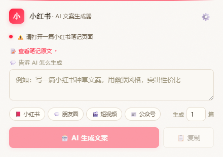

# 小红书→AI文案生成器

Chrome 浏览器插件，一键提取小红书笔记内容，直接调用 AI 生成文案。



## 功能

- 📖 **一键提取**：在小红书笔记页面自动抓取标题、正文、作者、标签
- 🤖 **AI 生成**：直接调用 Claude / GPT / DeepSeek 等模型生成文案
- 🏷️ **多版本标签页**：一次生成多篇时以标签页切换，自动提取版本描述作为标签名
- 📋 **一键复制**：生成的文案一键复制到剪贴板
- 🎨 **多文案类型**：内置小红书 / 朋友圈 / 短视频脚本 / 公众号文章快捷指令
- 🔌 **多提供商**：支持 Anthropic、OpenAI、DeepSeek 及任何 OpenAI 兼容接口

## 安装

1. 打开 Chrome，地址栏输入 `chrome://extensions`
2. 右上角开启「开发者模式」
3. 左上角点「加载已解压的扩展程序」
4. 选择本文件夹
5. 点插件图标 → ⚙️ → 填入 API Key → 保存

> **提示**：API Key 会自动保存到 Chrome 本地存储，打开设置页时会自动回填，无需重复输入。

## 使用

```
打开小红书笔记 → 点插件图标 → 输入自定义指令（或点快捷按钮）
→ 设置生成篇数 → 点「AI 生成文案」→ 切换标签页查看各版本 → 复制
```

### 快捷指令

| 按钮 | 填充指令 |
|------|---------|
| 📕 小红书 | 口语化种草风格，加 emoji 和话题标签 |
| 💬 朋友圈 | 短小精悍，有情感温度 |
| 🎬 短视频 | 带画面描述和配音，开头有钩子 |
| 📰 公众号 | 结构清晰，有深度 |

### 多版本生成

在「生成 X 篇」输入框设置数量（1-10），AI 会生成多个不同角度的版本。结果以**标签页**形式展示，自动从 AI 输出中提取版本描述作为标签名（如「幽默种草」「专业评测」），点击标签即可切换查看。

## API Key 获取

| 提供商 | 获取地址 | 默认模型 |
|--------|---------|---------|
| Anthropic | https://console.anthropic.com/settings/keys | claude-sonnet-4-6 |
| OpenAI | https://platform.openai.com/api-keys | gpt-5 |
| DeepSeek | https://platform.deepseek.com/api_keys | deepseek-v4-flash |

## 设计

整体采用 **Warm Editorial（温暖编辑美学）** 风格：
- 暖色调奶油纸纹背景 + SVG 噪点纹理
- 宋体/衬线标题 × 苹方/雅黑正文的编辑级字体搭配
- 小红书红 `#ff2442` 作为克制点缀色
- 层叠卡片阴影、圆角滚动条、装饰渐变顶线
- 状态指示点（绿/橙/红呼吸灯）+ 微交互动画

## 文件结构

```
├── manifest.json    # 插件配置（Manifest V3）
├── content.js       # 页面内容提取（在小红书页面运行）
├── popup.html       # 插件弹窗界面 + 内联 CSS
├── popup.js         # 弹窗逻辑 + AI API 调用 + 标签页渲染
├── options.html     # API 设置页面
├── options.js       # 设置逻辑 + 连接测试
└── icons/           # 图标
```

## 开发

所有 UI 样式内联在 HTML 中，无外部 CSS/JS 依赖，无需构建工具。修改后到 `chrome://extensions` 点「刷新」即可生效，**无需移除重装**（移除会导致本地存储的 API Key 丢失）。
